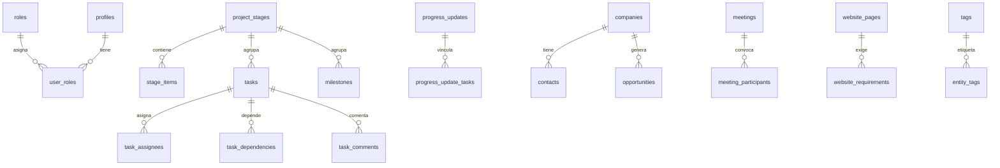

# Esquema de Supabase

## 1. Objetivo de la base de datos

Sostener el seguimiento interno de Sapiens Industrial: etapas, trabajo, decisiones, documentos, comercial y auditoría. Un solo proyecto. Sin datos personales reales en semillas.

## 2. Convenciones de nombres

- Tablas y columnas en `snake_case` inglés.
- Enums con valores semánticos en español (`en_curso`).
- Claves primarias `id uuid` con `gen_random_uuid()`.
- Tiempos en `timestamptz`.
- Claves foráneas con nombre `fk_<tabla>_<columna>`.
- Índices `idx_<tabla>_<columnas>`.
- Políticas `p_<tabla>_<accion>_<rol_o_alcance>`.

## 3. Diagrama conceptual

## 4. Enumeraciones previstas

| Enum | Valores |
| --- | --- |
| `app_role` | administrador, socio, colaborador, solo_lectura |
| `stage_status` | no_iniciada, planificada, en_curso, bloqueada, completada, pausada |
| `task_status` | pendiente, en_curso, bloqueada, finalizada |
| `task_priority` | baja, media, alta, critica |
| `milestone_status` | pendiente, alcanzado, cancelado |
| `decision_status` | propuesta, pendiente, tomada, revisada, descartada |
| `decision_impact` | bajo, medio, alto |
| `opportunity_stage` | identificada, por_contactar, contactada, reunion_programada, diagnostico, propuesta_enviada, negociacion, ganada, perdida, pausada |
| `meeting_mode` | presencial, virtual, hibrida |
| `website_page_status` | no_iniciada, en_redaccion, en_diseno, en_revision, lista, publicada |
| `entity_kind` | task, milestone, progress_update, decision, document, meeting, company, opportunity, website_page, stage |

`vencida` no es enum: se calcula por `due_date` y estado distinto de `finalizada`.

## 5 a 14. Tablas

Implementadas en Fase 2: `app_settings`, `profiles`, `roles`, `user_roles`.
Implementadas en Fase 3: `project_stages`, `stage_items`, `tasks`, `task_assignees`, `task_dependencies`, `task_comments`, `milestones`, `progress_updates`, `progress_update_tasks`.
El resto sigue propuesto para Fases 4 a 7.

### `app_settings`

Propósito: configuración global (una fila).

| Columna | Tipo PostgreSQL | Null | Predeterminado | Clave | Descripción |
| ------- | --------------- | ---- | -------------- | ----- | ----------- |
| id | uuid | no | gen_random_uuid() | PK | Identificador |
| project_name | text | no | | | Nombre del proyecto |
| timezone | text | no | 'America/Argentina/Cordoba' | | Zona horaria |
| locale | text | no | 'es-AR' | | Locale |
| created_at | timestamptz | no | now() | | Alta |
| updated_at | timestamptz | no | now() | | Modificación |
| updated_by | uuid | sí | | FK profiles | Autor del cambio |

Relaciones: `updated_by` → `profiles.id`. Restricción: máximo una fila. RLS: lectura autenticada; escritura administrador.

### `profiles`

Propósito: perfil de cada usuario de Auth.

| Columna | Tipo PostgreSQL | Null | Predeterminado | Clave | Descripción |
| ------- | --------------- | ---- | -------------- | ----- | ----------- |
| id | uuid | no | | PK, FK auth.users | Mismo id de Auth |
| full_name | text | no | | | Nombre visible |
| avatar_path | text | sí | | | Ruta en Storage |
| job_title | text | sí | | | Cargo |
| phone | text | sí | | | Teléfono |
| is_active | boolean | no | true | | Permite escribir |
| created_at | timestamptz | no | now() | | Alta |
| updated_at | timestamptz | no | now() | | Modificación |

Trigger: alta automática al crear `auth.users`.

### `roles`

Catálogo de roles.

| Columna | Tipo PostgreSQL | Null | Predeterminado | Clave | Descripción |
| ------- | --------------- | ---- | -------------- | ----- | ----------- |
| id | uuid | no | gen_random_uuid() | PK | Identificador |
| code | app_role | no | | unique | Código estable |
| name | text | no | | | Nombre visible |
| description | text | sí | | | Descripción |

### `user_roles`

Un rol por usuario (`unique user_id`).

| Columna | Tipo PostgreSQL | Null | Predeterminado | Clave | Descripción |
| ------- | --------------- | ---- | -------------- | ----- | ----------- |
| id | uuid | no | gen_random_uuid() | PK | Identificador |
| user_id | uuid | no | | FK, unique | Perfil |
| role_id | uuid | no | | FK | Rol |
| created_at | timestamptz | no | now() | | Alta |
| created_by | uuid | sí | | FK | Quién asignó |

### `project_stages`

Las ocho etapas de la ruta.

| Columna | Tipo PostgreSQL | Null | Predeterminado | Clave | Descripción |
| ------- | --------------- | ---- | -------------- | ----- | ----------- |
| id | uuid | no | gen_random_uuid() | PK | Identificador |
| slug | text | no | | unique | Identificador estable |
| name | text | no | | | Nombre |
| sort_order | smallint | no | | unique | 1 a 8 |
| status | stage_status | no | 'no_iniciada' | | Estado |
| owner_id | uuid | sí | | FK | Responsable |
| planned_start | date | sí | | | Inicio previsto |
| planned_end | date | sí | | | Fin previsto |
| progress_percent | numeric(5,2) | no | 0 | | 0 a 100 |
| summary | text | sí | | | Resumen |
| created_at | timestamptz | no | now() | | Alta |
| updated_at | timestamptz | no | now() | | Modificación |
| created_by | uuid | sí | | FK | Autor |
| updated_by | uuid | sí | | FK | Editor |

CHECK: `progress_percent` entre 0 y 100; `planned_end >= planned_start` si ambas existen.

### `stage_items`

Checklist metodológico de cada etapa. Distinto de las tareas operativas.

| Columna | Tipo PostgreSQL | Null | Predeterminado | Clave | Descripción |
| ------- | --------------- | ---- | -------------- | ----- | ----------- |
| id | uuid | no | gen_random_uuid() | PK | Identificador |
| stage_id | uuid | no | | FK | Etapa |
| title | text | no | | | Ítem |
| description | text | sí | | | Detalle |
| is_done | boolean | no | false | | Completado |
| sort_order | smallint | no | | | Orden |
| owner_id | uuid | sí | | FK | Responsable |
| created_at | timestamptz | no | now() | | Alta |
| updated_at | timestamptz | no | now() | | Modificación |

### `tasks`

Trabajo operativo.

| Columna | Tipo PostgreSQL | Null | Predeterminado | Clave | Descripción |
| ------- | --------------- | ---- | -------------- | ----- | ----------- |
| id | uuid | no | gen_random_uuid() | PK | Identificador |
| title | text | no | | | Título |
| description | text | sí | | | Descripción |
| stage_id | uuid | no | | FK | Etapa |
| category | text | sí | | | Categoría |
| priority | task_priority | no | 'media' | | Prioridad |
| status | task_status | no | 'pendiente' | | Estado |
| owner_id | uuid | sí | | FK | Responsable |
| start_date | date | sí | | | Inicio |
| due_date | date | sí | | | Límite |
| progress_percent | numeric(5,2) | no | 0 | | 0 a 100 |
| notes | text | sí | | | Observaciones |
| tags | text[] | no | '{}' | | Etiquetas simples |
| created_at | timestamptz | no | now() | | Alta |
| updated_at | timestamptz | no | now() | | Modificación |
| created_by | uuid | sí | | FK | Autor |
| updated_by | uuid | sí | | FK | Editor |

Índices previstos: `stage_id`, `status`, `owner_id`, `due_date`.

### Tablas hijas de tareas

- `task_assignees`: colaboradores (`task_id`, `user_id`, unique par).
- `task_dependencies`: `task_id`, `depends_on_task_id`. Sin auto-referencia.
- `task_comments`: comentario, autor, fechas.

### `milestones`

Hitos por etapa: nombre, descripción, fecha objetivo, fecha alcanzada, estado, responsable, evidencia textual, observaciones.

### `progress_updates` y `progress_update_tasks`

Avances periódicos con porcentajes anterior y nuevo, dificultades, decisiones, próximos pasos y N:N hacia tareas.

### `decisions` y `decision_parties`

Registro de decisiones y responsables.

### `documents`

Catálogo de conocimiento: tipo, categoría, etapa, enlace externo, `storage_path`, versión, responsable.

### `tags` y `entity_tags`

Etiquetas polimórficas (`entity_kind` + `entity_id`).

### `companies`, `contacts`, `opportunities`

CRM simple. La oportunidad tiene etapa comercial, probabilidad, valor estimado, próxima acción y responsable.

### `meetings` y `meeting_participants`

Reuniones, modalidad, agenda, notas, acuerdos y próxima reunión.

### `website_pages` y `website_requirements`

Seguimiento de la web pública futura.

### `attachments`

Metadatos de archivos en Storage. Nunca el binario en PostgreSQL.

### `notifications`

Avisos internos. Tabla prevista; UI diferida.

### `audit_logs`

Append-only: actor, fecha, entidad, acción, `old_data`, `new_data`.

## 15. Políticas RLS

Ver detalle operativo en `docs/security-and-rls.md`. Implementadas para auth (Fase 2) y seguimiento (Fase 3).

## 16. Triggers

Implementados:

- `set_updated_at` en `profiles`, `app_settings`, etapas, ítems, tareas, comentarios, hitos y avances.
- `protect_profile_privileges` (un no admin no cambia `is_active` ni `id`).
- `handle_new_user` sobre `auth.users`.

Pendiente: `write_audit_log` en Fase 5.

## 17. Funciones

Implementadas: `current_app_role()`, `is_active_user()`, `is_admin()`, `is_staff()`, `handle_new_user()`, `set_updated_at()`, `protect_profile_privileges()`, `can_write_project()`, `can_edit_task(uuid)`, `recalculate_stage_progress(uuid)`.

`recalculate_stage_progress` promedia el % de ítems hechos y el % de tareas (`finalizada` = 100). Las ocho etapas pesan igual.

Todas las `SECURITY DEFINER` usan `search_path = public`.

## 18. Vistas previstas

- `v_task_status_counts`
- `v_stage_progress`
- `v_dashboard_kpis`
- `v_commercial_funnel`

## 19 y 20. Storage

Buckets privados `avatars`, `attachments`, `documents`. Todavía no creados (Fase 5).

## 21. Datos iniciales

La migración de Fase 2 inserta los 4 roles y una fila de `app_settings`. La de Fase 3 siembra las 8 etapas (`demos-y-caso-modelo` en la quinta) y 24 ítems de checklist. `seed.sql` no corre solo.

## 22. Orden de migraciones

1. `20260920190000_auth_profiles_roles.sql`
2. `20260920220000_stages_tasks_milestones_progress.sql`

## 23. Historial de cambios

Ver `docs/schema-changelog.md`.
